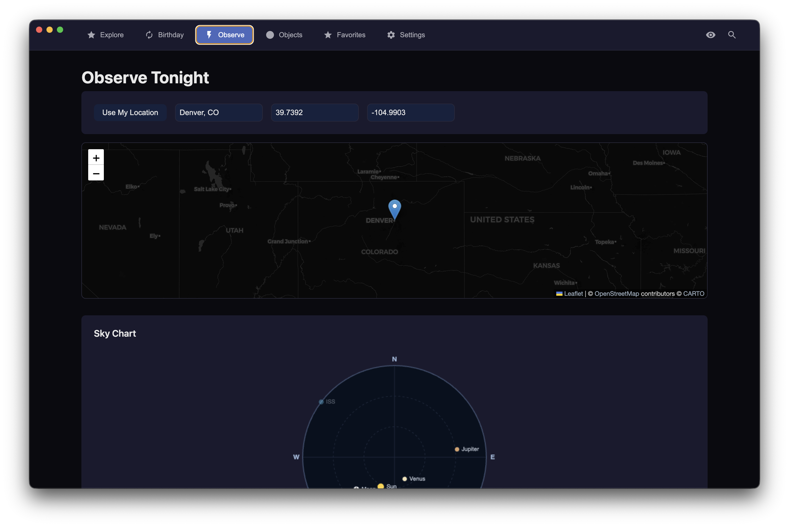

# 🚀 Astronomer

A secure, React-free Electron desktop application for exploring astronomy data and planning observations. Built with vanilla JavaScript, HTML, and CSS — plus a static browser build that runs the same UI without Electron.


**Live demo:** <https://guildmasterdev.github.io/Astronomer/>



## ✨ Features

### 🌌 Explore
- **NASA APOD**: Browse Astronomy Picture of the Day with date picker and random selection
- **Image & Video Library**: Search NASA's extensive media collection
- **EPIC Earth Images**: View recent natural color images of Earth from space
- **ISS Tracker**: Real-time International Space Station position and pass predictions

### 🎂 Hubble on Your Birthday
- Discover what Hubble saw on your birthday
- Browse through years of Hubble observations
- Smart date matching with ±3 day tolerance

### 🔭 Observe Tonight
- Location-based observation planning (manual or GPS)
- Twilight times (civil, nautical, astronomical)
- Moon phase and illumination calculations
- Planet visibility predictions
- ISS pass predictions for your location

### 🪐 Objects
- Solar System object catalog with real-time data
- Notable exoplanet database
- Distance calculations and tracking
- Quick facts and observation windows

### ⭐ Favorites & Sharing
- Save any image, object, or observation
- Export favorites as JSON
- Share functionality with system integration

### ⚙️ Settings
- NASA API key configuration
- Dark/Light theme switching
- Metric/Imperial units
- Location defaults
- Performance modes and caching

## 🌐 Web demo

The live demo at <https://guildmasterdev.github.io/Astronomer/> runs the same UI directly in the browser — no download required. A few notes:

- It defaults to NASA's shared `DEMO_KEY`, which has tight hourly rate limits. A one-minute signup at <https://api.nasa.gov/> yields a free personal key; drop it into **Settings → NASA API Key** and the demo-mode banner disappears.
- Favorites and settings persist to `localStorage`, so they stay on the device you used.
- Everything astronomical — twilight, moon phase, planet positions, ISS passes — runs client-side via `astronomy-engine` and `satellite.js`.
- Location can come from the browser's Geolocation API (you'll be prompted) or from a manual entry.

The desktop build remains the better option for heavy usage (no CORS constraints, persistent encrypted store, native dialogs).

## 🔒 Security Features

- **Context Isolation**: Enabled by default
- **Sandbox Mode**: All renderer processes sandboxed
- **CSP Headers**: Strict Content Security Policy
- **API Whitelisting**: Only approved endpoints accessible
- **Rate Limiting**: Built-in request throttling
- **No Remote Code**: No external script execution

## 🚀 Quick Start

### Prerequisites
- Node.js 20+
- npm
- NASA API Key (optional, uses `DEMO_KEY` by default — configure in the in-app Settings)

### Installation

```bash
# Clone the repository
git clone https://github.com/guildmasterdev/Astronomer.git
cd Astronomer

# Install dependencies
npm install

# Run the desktop app
npm run dev
```

### Get Your NASA API Key

1. Visit [api.nasa.gov](https://api.nasa.gov/)
2. Register for a free API key
3. Add it in **Settings → NASA API Key** (desktop or web)

## 📦 Building

```bash
# Desktop production build (TypeScript + Vite renderer)
npm run build

# Package desktop app for a specific platform
npm run pack:mac
npm run pack:win
npm run pack:linux

# Static web build (output: dist-web/)
npm run build:web
npm run preview:web   # local preview
```

## 🎮 Keyboard Shortcuts

| Shortcut | Action |
|----------|--------|
| `1-6` | Switch tabs (Explore, Birthday, Observe, Objects, Favorites, Settings) |
| `Cmd/Ctrl+F` | Focus search |
| `Cmd/Ctrl+K` | Quick actions |
| `R` | Refresh current view |
| `Cmd/Ctrl+E` | Export favorites |
| `Esc` | Close modal |

## 🏗️ Architecture

```
Astronomer/
├── src/
│   ├── main/           # Electron main process
│   │   ├── main.ts     # App entry point, BrowserWindow + CSP
│   │   ├── menu.ts     # Application menu
│   │   ├── store.ts    # Persistent storage (electron-store)
│   │   ├── ipc.ts      # IPC handlers
│   │   ├── endpoints.ts # API whitelist
│   │   ├── astronomy.ts # Sun/moon/planet compute
│   │   ├── iss.ts      # TLE + SGP4 pass prediction
│   │   └── rate-limiter.ts
│   ├── preload/        # Secure context bridge
│   │   └── preload-simple.js
│   ├── renderer/       # UI (vanilla JS, shared by desktop + web)
│   │   ├── index.html
│   │   ├── styles.css
│   │   ├── app-complete.js   # application logic
│   │   └── public/vendor/    # bundled Leaflet
│   └── web/            # Static browser build
│       ├── index.html  # web shell with demo banner
│       ├── main.js     # window.astronomer shim + loader
│       └── prepare.mjs # stages shared renderer assets
├── dist/               # Compiled desktop output
├── dist-web/           # Compiled web output
└── dist-electron/      # Packaged installers
```

## 🔧 Development

```bash
npm run dev        # Compiles TS then launches Electron
npm run dev:vite   # Vite-hosted renderer (for live reload)
npm run build:web  # Static web build
npm test           # vitest
npm run test:e2e   # playwright
npm run lint       # ESLint 9 (flat config)
npm run typecheck  # tsc --noEmit
```

### API Endpoints

The app uses these NASA and astronomy APIs (whitelisted in both the desktop CSP and the web fetch adapter):

- NASA APOD API
- NASA Image and Video Library
- NASA EPIC API
- JPL Horizons API
- ISS Location API (wheretheiss.at)
- ISS TLE (tle.ivanstanojevic.me)
- NASA Exoplanet Archive

## 🔐 Privacy & Security

- **No tracking**: Zero telemetry by default
- **Local storage**: All data stored locally (`electron-store` on desktop, `localStorage` in the web demo)
- **No accounts**: No user accounts or cloud sync
- **Whitelisted APIs**: Desktop builds route every external call through a validated allow-list; CSP blocks everything else
- **Open source**: Full code transparency

## 🤝 Contributing

Contributions are welcome! Please read our contributing guidelines before submitting PRs.

1. Fork the repository
2. Create your feature branch (`git checkout -b feature/amazing-feature`)
3. Commit your changes (`git commit -m 'Add amazing feature'`)
4. Push to the branch (`git push origin feature/amazing-feature`)
5. Open a Pull Request

## 📝 License

MIT License — see [LICENSE](LICENSE) file for details.

## 🙏 Credits

- NASA APIs for providing amazing space data
- `astronomy-engine` for celestial calculations
- `satellite.js` for SGP4/SDP4 propagation
- Electron team for the framework
- All contributors and testers

## 📮 Support

- Report issues: [GitHub Issues](https://github.com/guildmasterdev/Astronomer/issues)
- Documentation: [Wiki](https://github.com/guildmasterdev/Astronomer/wiki)

---

Built with ❤️ for space enthusiasts everywhere
